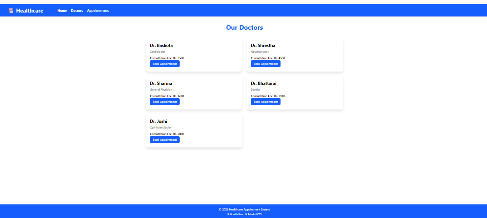

# 🏥 Healthcare Appointment App

A responsive healthcare appointment booking application built with React, React Router, Tailwind CSS, and Local Storage.

## ✨ Features

- 🏠 Home page with healthcare services
- 👨‍⚕️ Browse available doctors
- 📅 Book appointments with doctors
- 📋 View all booked appointments
- ❌ Delete appointments
- 💾 Local Storage support (appointments persist after refresh)
- 📱 Responsive and clean UI

## 🛠️ Technologies Used

- React
- React Router DOM
- JavaScript (ES6+)
- Tailwind CSS
- Vite

## 🚀 Installation

```bash
git clone https://github.com/sam123227/healthcare-appointment-app.git
cd healthcare-appointment-app
npm install
npm run dev
```

## 📸 Screenshot




## 👨‍💻 Author

**Samir**
